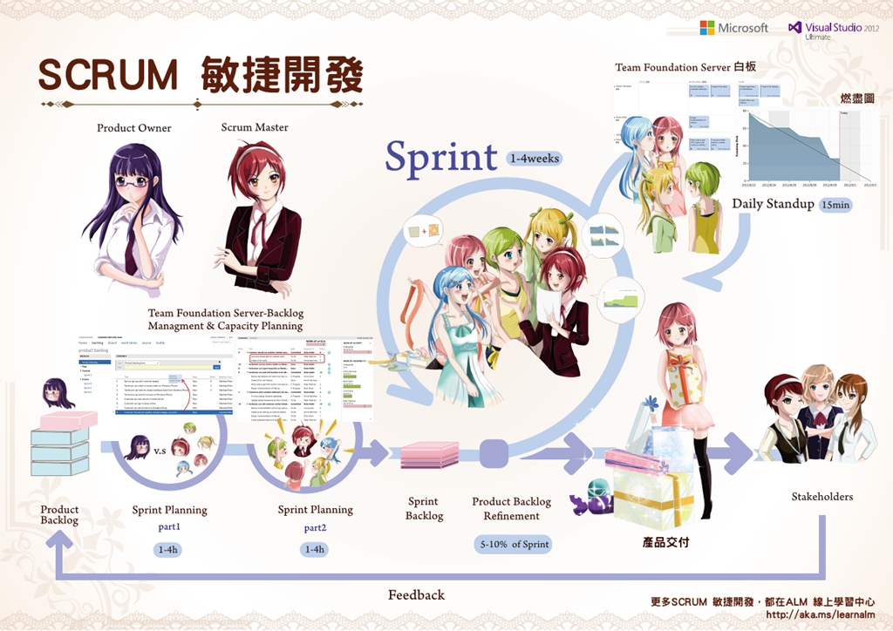

# SCRUM

## 三四三話 Scrum
Scrum 敏捷開發只是一個簡單的框架（Framework），核心元素包含有：3種角色、4個會議、3項產出。

*	3種角色：Scrum教練、產品負責人和團隊。

*	4個會議：衝刺規畫會議、每日站立會議、衝刺審查會議以及衝刺回顧會議。

*	3項產出：產品待辦清單、衝刺待辦清單和燃盡表。

## Scrum的 3 種角色

在Scrum敏捷開發中，提出了3種主要的角色，分別說明如下：

*	產品負責人（Product Owner）：其實，產品負責人這個角色有點像是客戶代表。他會站在比較接近客戶的立場，去設定產品待辦項目的優先順序，以及為團隊說明客戶的需求。

*	Scrum教練（Scrum Master）：Scrum 教練必須熟知整個 Scrum 敏捷開發，以便能夠協助產品負責人和團隊的運作。

*	團隊（Team）：就是一般的開發團隊，通常是跨職能的組成，也就是團隊成員混合著架構師、分析師、設計師、軟體工程師、測試員等等。

## Scrum的 4 個會議
在每一個衝刺（Sprint）期間，除了團隊需要實際執行分內的任務外，Scrum還定義了4個重要的會議，分別簡單敘述如下：

*	衝刺計畫會議（Sprint Planning Meeting）：每個衝刺期間的一開始必須先舉行衝刺計畫會議，主要用來決定該衝刺期間的待辦項目，以及團隊的衝刺任務。

*	每日站立會議（Daily Standup Meeting）：衝刺期間的每一天早上，都要執行15分鐘的站立會議，主要可以用來了解團隊的工作執行狀況。

*	衝刺審查會議（Sprint Review Meeting）：每個衝刺的最後一天會先執行衝刺審查會議，隨後執行衝刺回顧會議。在衝刺審查會議中，主要用來展示並了解該衝刺的待辦項目達成狀況。

*	衝刺回顧會議（Sprint Retrospective Meeting）：相較之下，前述的衝刺審查會議，其討論的主題鎖定在「產品」上頭。而此處的衝刺回顧會議，其討論的主題則聚焦在團隊的「開發程序」上頭，主要用來討論並調整下一期衝刺的開發程序。

## Scrum的3項產出

*	產品待辦清單（Product Backlog）：其實，產品待辦清單的概念很簡單，它主要包含了一般常見的功能性需求和非功能性需求；不過，比較特別的是，它還包含了技術團隊提出的需求，而不只是照顧到客戶的需求而已。
也因此，Scrum敏捷開發特別採用了「產品待辦清單」（Product Backlog）的字眼，用來跟傳統作法上只照顧客戶的系統需求，做字面上的分野。

*	衝刺待辦清單（Sprint Backlog）：衝刺待辦清單中的待辦項目，其實是產品待辦清單的子集。在每一次的衝刺規畫會議中，才會開會決定要處理哪些待辦項目。

*	燃盡圖（Burndown Chart）：簡單來說，我們可以繪製燃盡圖，來呈現一個時間區段中，剩餘的工作量。所以，有些文章或書籍中，也將「Burndown Chart」中譯為「剩餘工作圖」或者是「剩餘時間圖」，原因正是如此。

## 參考資料

<http://www.ithome.com.tw/node/68213>
