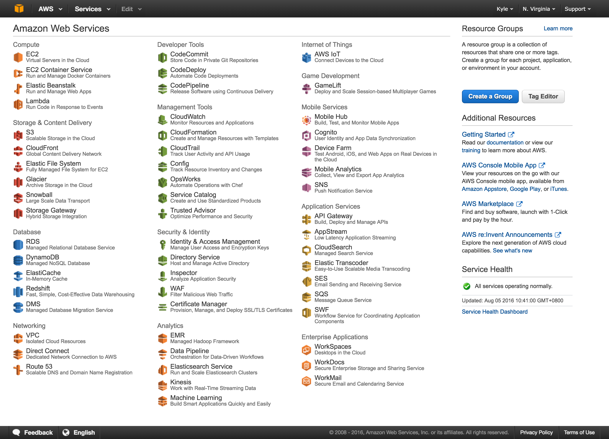
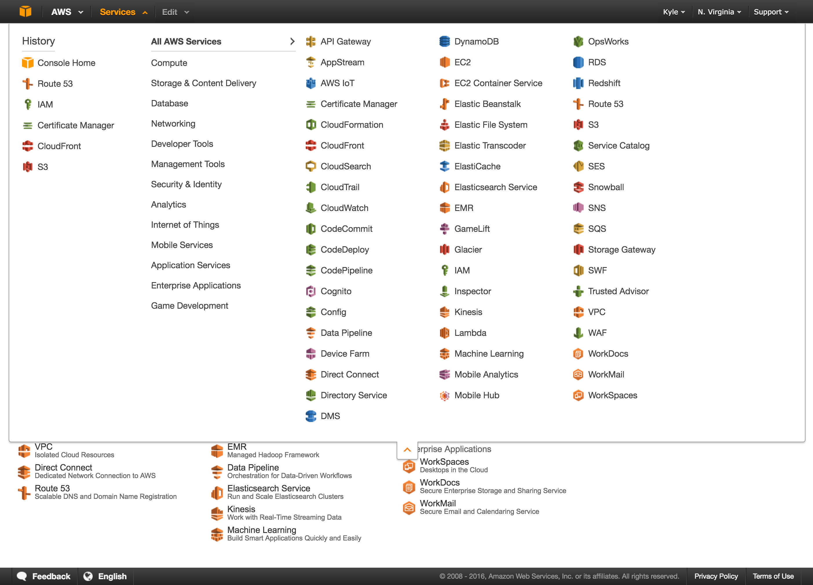

# 入門

## Learning Path

## 全球可用區域

* Regions
* Availability Zones
* Edge Locations

Command Line Usages

```
aws ec2 describe-regions
aws ec2 describe-availability-zones
```

### Storage

* S3
* Glacier
* Elastic File System
* Snowball

### Content Delivery

* CloudFront

### Database

* RDS
* DynamoDB
* ElastiCache
* Redshift

### Networking

* VPC
* Route53

### Compute

* EC2
* Lambda

### Developer Tools

* CodeCommit

### Management Tools

* CloudWatch

### Application Services

* Elastic Transcoder
* SES
* SQS

## AWS Management Console

AWS 服務管理後台。



## All AWS Services

截至 2016 年 7 月止，AWS 已經提供超過 60 種雲端服務。



## 測驗

---

What does an AWS Region consist of?
1. A console that gives you quick, global picture of your cloud computing environment.
2. A collection of databases that can only be accessed from a specific geographic region.
3. An independent collection of AWS computing resources in a defined geography.
4. A distinct location within a geographic area designed to provide high availability to a specific geography.
5. A content distribution network, which is used to distribute content to users.

---
