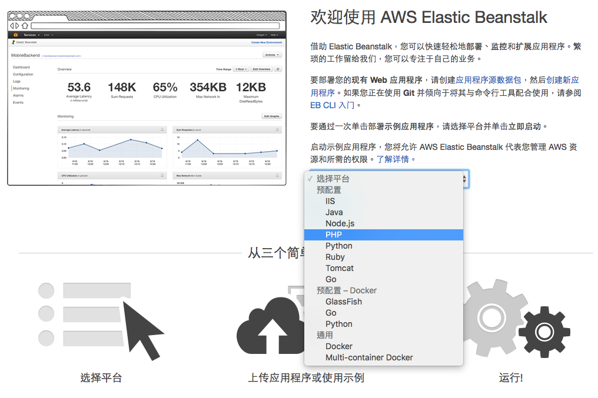
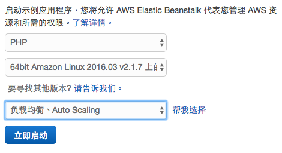

# AWS Elastic Beanstalk

* Application
* Environment
* Version

建立 PHP 平台。





## Elastic Beanstalk Command Line Interface

awsebcli

https://docs.aws.amazon.com/elasticbeanstalk/latest/dg/eb-cli3-install.html?icmpid=docs_elasticbeanstalk_console

```
mkdir HelloWorld
cd HelloWorld
eb init -p PHP
echo "Hello World" > index.html
eb create dev-env
eb open
eb deploy
```

其他常用指令。

```
eb list
eb status
eb config
eb terminate
```

搭配 Git 版本控制部署。

```
git checkout develop
eb use dev-env

git checkout master
eb use prod-env
```

建立 Laravel 新專案。

```
curl -s https://getcomposer.org/installer | php
php composer.phar create-project --prefer-dist laravel/laravel eb-laravel
cd eb-laravel
zip ../laravel-default.zip -r * .[^.]*
```

執行本地端測試開發環境。

```
php artisan serve
```

## Auto Scaling

設定自動水平擴展（Auto Scaling）
