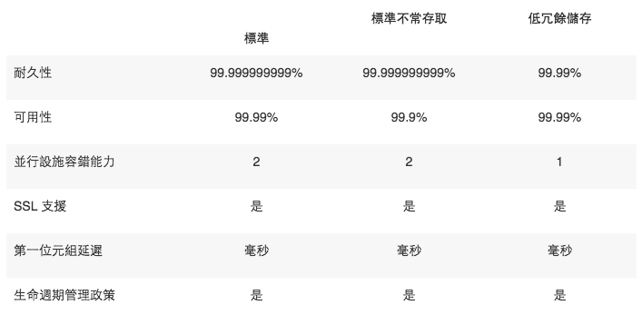
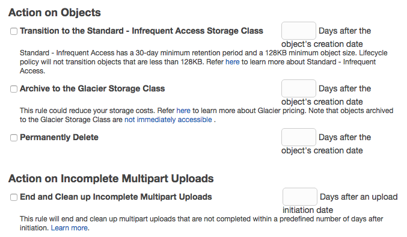
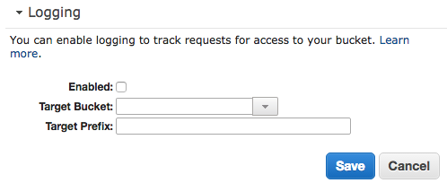
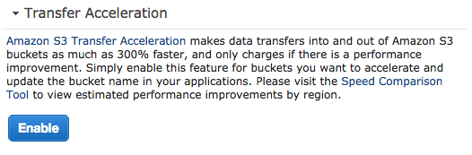

## Simple Storage Services （S3）

Amazon S3 是針對網際網路的儲存服務。它是一種簡單的儲存服務，以較低的成本為軟體開發人員提供高度可擴展、可靠及低延遲的資料儲存體基礎設施。

* S3 提供容易使用的 Web Services API 給應用程式存放和擷取資料。
* Object based storage
* 安全可靠的雲端儲存空間
* 按照實際用量（儲存容量、傳輸流量）付費
* 很高的擴展性（scalability）：從小用量起步、到大型企業級海量儲存皆不影響效能與可靠性
* 很高的靈活性：相同資料大量讀取一百萬次、或是僅在緊急災難復原時讀取
* 讓開發人員不用再擔心如何存放資料 => 專注於創新

## Terms

* Bucket
  * just like a directory
  * names must be unique globally
* Object
  * files sotred in buckets
* Key
  * the name (or path) of the objects
* Value
  * data, a sequence of bytes
* Version ID
  * Important for versioning
* Metadata
  * `Content-Type`
  * `Content-Encoding`
  * `Cache-Control`
* ACL
  * Access Control Lists
* Lifecycle
* Permissions
* Encryption
  * S3 提供 `AES-256` Sever Side Encryption
* CORS
  * cross-domain policies

```
https://s3-ap-northeast-1.amazonaws.com/s3.example.com/assets/css/main.css

// Bucket Name => ?
// Object Key => ?
```

## 容量限制？

* **無上限** 的儲存容量
* 單一物件（檔案）大小限制為 5 TB
* 每一次 PUT 可上傳最大為 5 GB
* 大於 100MB 的物件，應使用分段上傳（multipart upload or chunking）
* 預設可最多建立 100 個 Bucket，若需要更多可向 AWS 提出申請

## S3 Storage Classes / Tiers

* S3，標準 (適用於經常存取資料的一般用途儲存)，99.99% 可用性
* S3 - IA，標準不常存取 (適用於長效但不常存取的資料)，99.9% 可用性
* S3 - RRS，去冗餘儲存（Reduced Redundancy Storage）
  * about [20%](http://harish11g.blogspot.tw/2013/05/Amazon-Web-Services-AWS-Cost-Saving-Tips-Amazon-S3-Reduced-Redundancy-storage-rrs-vs-std.html) off
  * 應用範例：儲存大量的縮圖（thumbnails）
* Glacier (適用於長期存檔）
  * 範例包括了數位媒體存檔、財務和醫療保健記錄、原始基因組序列資料、長期資料庫備份，以及法律規定必須保留的資料。



## 資料一致性

* 新物件 PUTS 提供先寫後讀（Read after Write consistency）
* 已存在物件的 Overwrite PUTS 與 DELETES 提供最終（eventual）的一致性

## Encryption

* In Transit; SSL/TLS
* At Rest
  * Server Side Encryption
  * AWS Key Management Service, Managed Keys - SSE-KMS
  * Server Side Encryption with Customer Provided Keys - SSE-C
* Client Side Encryption

## Lifecycle Management



## Access Logs

Enable logging



## Amazon S3 Transfer Acceleration

加速原理：利用 CloudFront 全球節點，優化檔案的傳輸路徑路由到 S3。

必須先至 AWS 控制台開啟 Bucket 的加速選項：



程式撰寫時使用 s3-accelerate URL Endpoint：

```
bucketname.s3-accelerate.amazonaws.com
```

* Speed Comparison

http://s3-accelerate-speedtest.s3-accelerate.amazonaws.com/en/accelerate-speed-comparsion.html

```
http://s3-accelerate-speedtest.s3-accelerate.amazonaws.com/en/accelerate-speed-comparsion.html?region=region&origBucketName=yourBucketName
```

## Amazon Glacier 檔案備份工具

### FastGlacier

FastGlacier is a freeware Windows Client for Amazon Glacier - an extremely low-cost storage service that provides secure and durable storage for data archiving and backup.

FastGlacier enables you to upload your files to Amazon Glacier using your full bandwidth. With FastGlacier you can also download your files from Amazon Glacier and manage the vaults with ease!

https://fastglacier.com/

### 其他

* https://cloudgates.net/
* http://simpleglacieruploader.brianmcmichael.com/
* http://www.cloudberrylab.com/
* https://github.com/MoriTanosuke/glacieruploader/

## S3 Compatible

* https://cloud.google.com/storage/
* https://www.dreamhost.com/cloud/storage/
* http://hicloud.hinet.net/
* https://www.minio.io/ or https://github.com/minio/minio

## S3 Tools

* http://s3browser.com/
* http://s3tools.org/s3cmd
* https://aws.amazon.com/tw/cli/

## Example: 使用 S3 放置網站靜態檔案

HTML outputs:

```html

```

Setup CDN URL in `config.php` and apply to HTML outputs:

```php
<?
// config.php

$CDN_URL = '';

// production only
// $CDN_URL = 'https://demo-creatop.s3-ap-northeast-1.amazonaws.com/';
?>

/assets/images/logo.png" alt="logo" />
```
