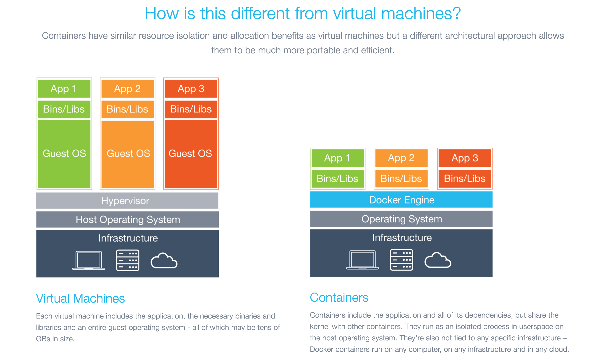

# Docker 與虛擬機器比較

下面的圖片比較了 Docker 和傳統虛擬化方式的不同之處，可見容器是在作業系統層面上實作虛擬化，直接使用本地主機的作業系統，而傳統方式則是在硬體層面實作。

作為一種新興的虛擬化方式，Docker 跟傳統的虛擬化方式相比具有眾多的優勢。

首先，Docker 容器的啟動可以在秒級實作，這相比傳統的虛擬機方式要快得多。 其次，Docker 對系統資源的使用率很高，一台主機上可以同時執行數千個 Docker 容器。

容器除了執行其中應用外，基本不消耗額外的系統資源，使得應用的效能很高，同時系統資源消耗更少。傳統虛擬機方式執行 10 個不同的應用就要啟動 10 個虛擬機，而 Docker 只需要啟動 10 個隔離的應用即可。
