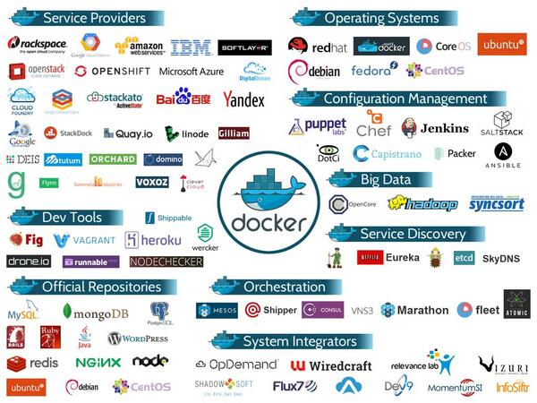

What is Docker
===============

Docker 是一個開源專案，誕生於 2013 年初，最初是 dotCloud 公司內部的一個業餘專案。Docker 的基礎是 Linux 容器（LXC）等技術，目標是實作輕量級的作業系統虛擬化解決方案。Docker 自從開放源碼後受到廣泛的關注與討論，以至於 dotCloud 公司都改名為 Docker Inc.。

* Released as open source in March 2013
* Join the Linux Foundation in June 2013 [1]
* Apache 2.0 License
* Written in Go

Docker Project (GitHub) - https://github.com/docker/docker

在 LXC 的基礎上 Docker 進行了進一步的封裝，讓使用者不需要去關心容器的管理，使得操作更為簡便。使用者操作 Docker 的容器就像操作一個快速輕量級的虛擬機一樣簡單。

Docker 受到業界大廠的擁戴：

* RedHat 已經在其 RHEL6.5 中集中支援 Docker。
* Amazon、Google 及 Microsoft 也在自家 PaaS 產品支援 Docker 服務。

 
[圖片來源](https://www.linkedin.com/pulse/docker-redefining-cloud-computing-landscape-akash-goswami)

  [1]: https://blog.docker.com/2013/06/dotcloud-and-docker-join-the-linux-foundation/ "Linux Foundation"
