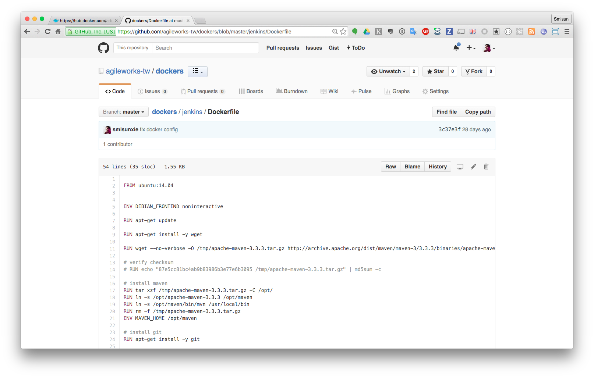
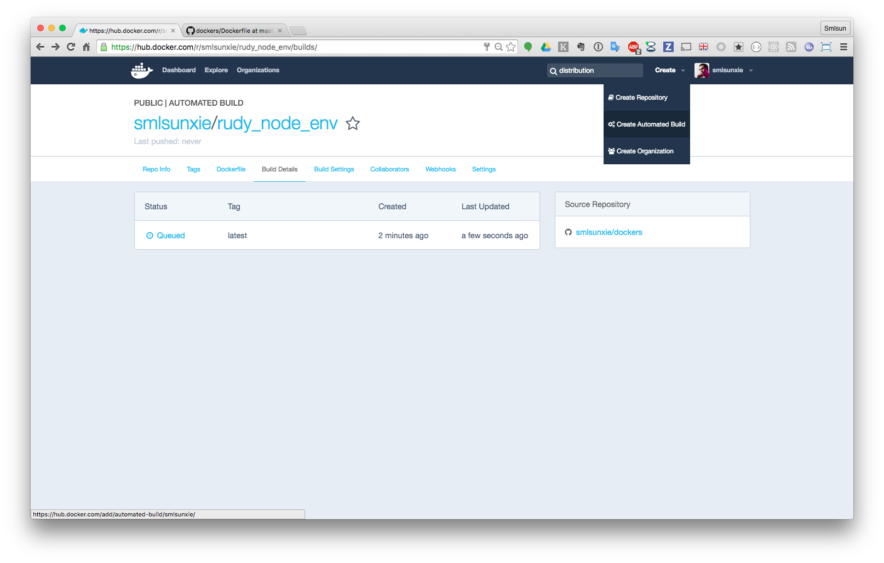
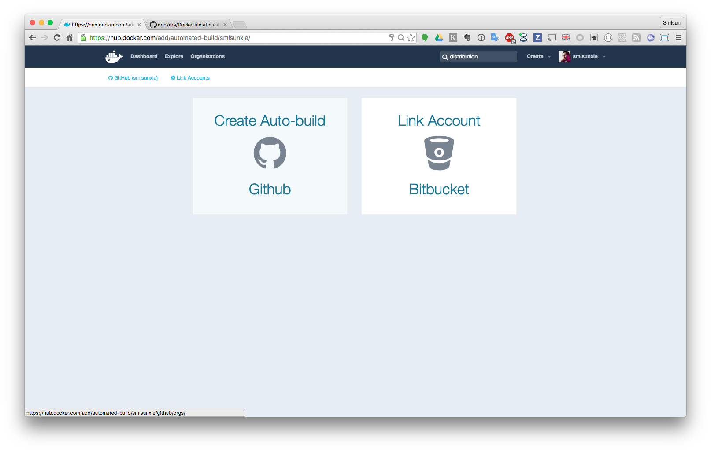
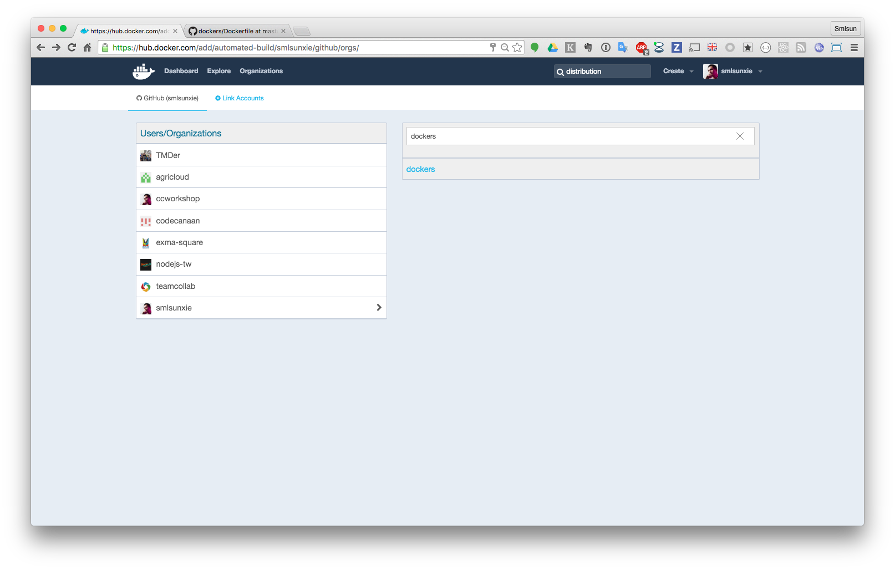
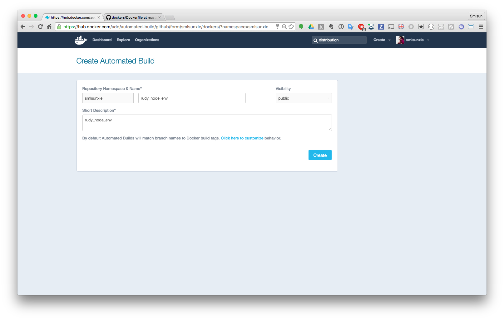
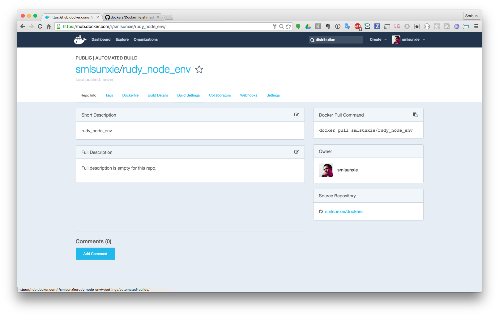
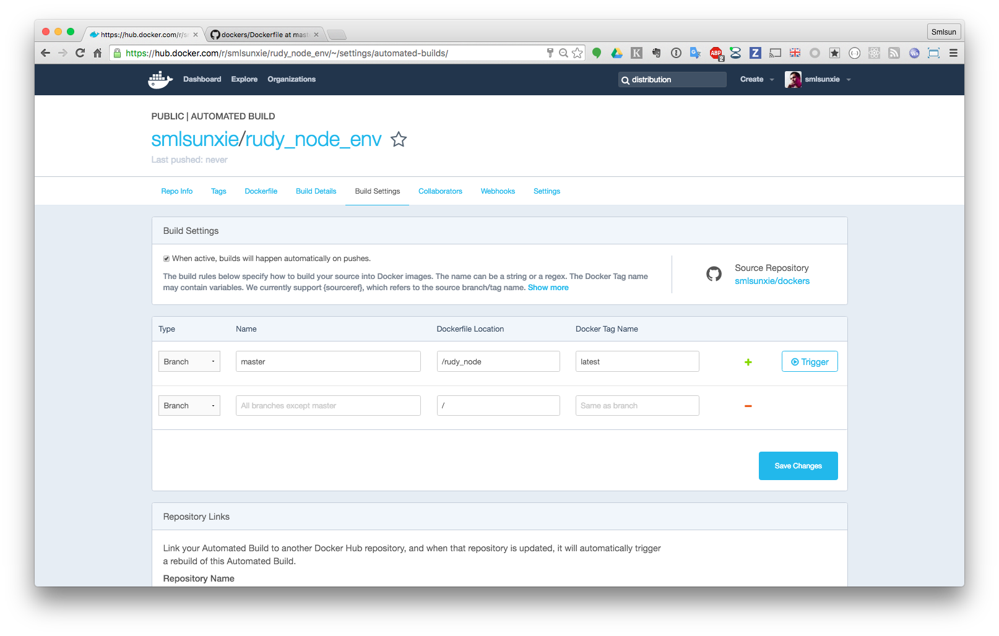
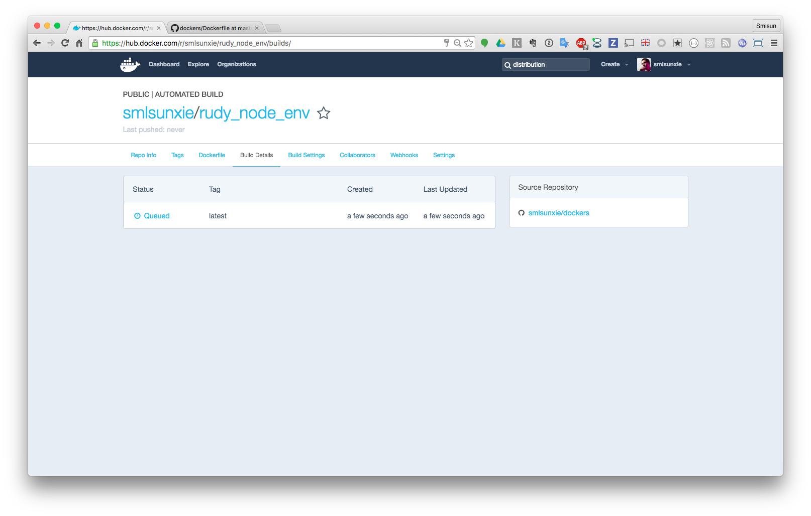

public Docker hub
=================

目前 Docker 官方有個 public Docker hub，裡面有數以萬計的 docker image，除了可以直接使用，也可以參考建置步驟

在開始使用之前，可以先進行登入

登入 Docker hub
---------------

官方提供了 `docker login` 指令，需要三個參數分別是

-	`-e`: email
-	`-p`: password
-	`-u`: user id

範例指令如下

```
docker login -e test@gmail.com -p testpass -u testuser
```

如此將可以完成登入，相關登入資訊會放在使用者 home 目錄底下之 `.dockercfg`，如此就可以不需要再重覆進行登入

search images
-------------

透過 docker search 找到合適的 image 以便使用，如透過下列指令進行搜尋

`docker search ubuntu`

將輸出下列資訊

```
NAME                              DESCRIPTION                                     STARS     OFFICIAL   AUTOMATED
ubuntu                            Ubuntu is a Debian-based Linux operating s...   3583      [OK]
ubuntu-upstart                    Upstart is an event-based replacement for ...   60        [OK]
torusware/speedus-ubuntu          Always updated official Ubuntu docker imag...   25                   [OK]
ubuntu-debootstrap                debootstrap --variant=minbase --components...   24        [OK]
rastasheep/ubuntu-sshd            Dockerized SSH service, built on top of of...   23                   [OK]
neurodebian                       NeuroDebian provides neuroscience research...   20        [OK]
```

auto build
----------

自動建置範例 dockerfile

[https://github.com/smlsunxie/dockers/blob/master/rudy_node/Dockerfile](https://github.com/smlsunxie/dockers/blob/master/rudy_node/Dockerfile)



### 操作步驟



選擇 Create Automated Builds



選擇要進行 auto build 的目標網站



選擇要進行 auto build 之帳號以及 repository



定義要在 docker hub 建立 repository 相關資訊



建立 docker hub 之 repository 完成後，進行 build setting



設定如圖，Dockerfile location 需要定義到目錄位置，設定完成後，執行 save 並且點選 trigger



接著進入到 build Details 可以看到目前正在等待建置，如此即完成 auto build
