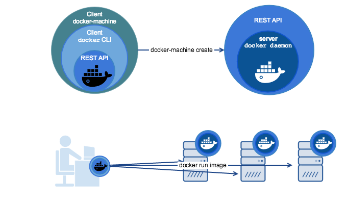

docker-machine
==============

所謂的 Docker Machine 簡單來說，就是一個可以讓你快速在不同平台上建立 Docker engine 的 command tool。

以往，如果你要建立一個 Docker engine，必須先 login 對應的平台（不管是 Cloud，如：AWS、Azure, 或自己的電腦、VM），進行各種設定。Docker Machine 提供了一個單一介面，讓你可以透過這個介面直接去控制各種不同 Host 上面的 Docker。

也就是說，如果你在很多平台上面都有 Docker, 現在可以不必分別登入，可以直接從 Docker Machine 這個介面去統一管理，並直接指定某個平台上的機器執行 Docker 命令。Docker Machine 讓你可以快速在任何平台上建立伺服器並安裝好 Docker, 完成與 Client 端溝通的設定。它建立的 Docker 主機預設就是安全的，伺服器與 client 端的連接都有進行加密和授權。

上圖上半段，可以看到 docker-machine 的運作原理，透過 docker-machine 對 client 的 docker CLI 操作 REST API 來進行遠端的 docker engine 建立。

而實際上就像上述所說明，透過 docker-machine 我們就可以如上圖下方，操作多台 docker engine 進行 container 之運行。
