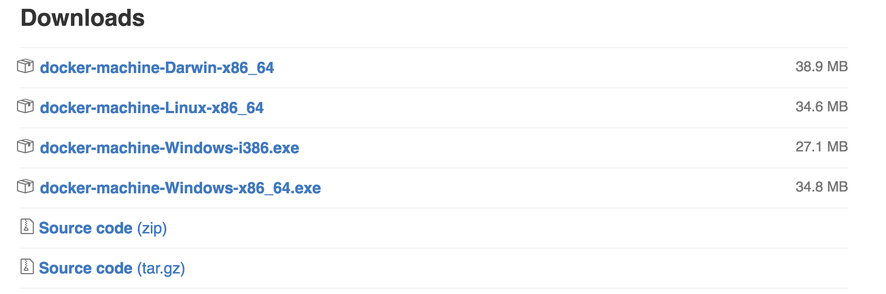

# install machine

## On OS X or Linux

```
$ curl -L https://github.com/docker/machine/releases/download/v0.7.0/docker-machine-`uname -s`-`uname -m` >/usr/local/bin/docker-machine && \
  chmod +x /usr/local/bin/docker-machine
```


## On Windows with git bash

```
$ if [[ ! -d "$HOME/bin" ]]; then mkdir -p "$HOME/bin"; fi && \
curl -L https://github.com/docker/machine/releases/download/v0.7.0/docker-machine-Windows-x86_64.exe > "$HOME/bin/docker-machine.exe" && \
chmod +x "$HOME/bin/docker-machine.exe"
```

## download page

<https://github.com/docker/machine/releases/>


