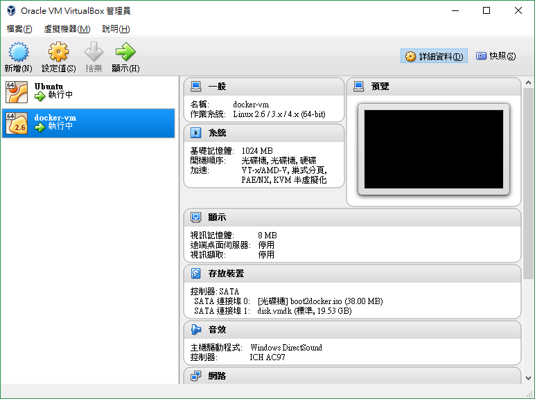

## 建立 docker vm

docker-machine.exe create --driver virtualbox docker-vm



執行完指令後就能看到 virtualbox 已建立 docker vm

## 查看目前所建立的 docker vm

docker-machine.exe ls

## 載入 docker env

docker-machine.exe env docker-vm

```
SET DOCKER_TLS_VERIFY=1
SET DOCKER_HOST=tcp://192.168.99.100:2376
SET DOCKER_CERT_PATH=C:\Users\Lenovo\.docker\machine\machines\docker-vm
SET DOCKER_MACHINE_NAME=docker-vm
SET COMPOSE_CONVERT_WINDOWS_PATHS=true
REM Run this command to configure your shell:
REM     @FOR /f "tokens=*" %i IN ('docker-machine.exe env docker-vm') DO @%i
```

執行

`@FOR /f "tokens=*" %i IN ('docker-machine.exe env docker-vm') DO @%i`

就可以直接操控 VM 了。


## 確認 docker 以正常運作

docker run hello-world


```
C:\Users\Lenovo
λ docker run hello-world
time="2017-04-07T12:26:19+08:00" level=info msg="Unable to use system certificate pool: crypto/x509: system root pool is not available on Windows"
Unable to find image 'hello-world:latest' locally
latest: Pulling from library/hello-world
78445dd45222: Pull complete
Digest: sha256:c5515758d4c5e1e838e9cd307f6c6a0d620b5e07e6f927b07d05f6d12a1ac8d7
Status: Downloaded newer image for hello-world:latest

Hello from Docker!
This message shows that your installation appears to be working correctly.

To generate this message, Docker took the following steps:
 1. The Docker client contacted the Docker daemon.
 2. The Docker daemon pulled the "hello-world" image from the Docker Hub.
 3. The Docker daemon created a new container from that image which runs the
    executable that produces the output you are currently reading.
 4. The Docker daemon streamed that output to the Docker client, which sent it
    to your terminal.

To try something more ambitious, you can run an Ubuntu container with:
 $ docker run -it ubuntu bash

Share images, automate workflows, and more with a free Docker ID:
 https://cloud.docker.com/

For more examples and ideas, visit:
 https://docs.docker.com/engine/userguide/
```

## 查看目前環境已有的 docker image

docker images


```
C:\Users\Lenovo
λ docker images
time="2017-04-07T12:26:19+08:00" level=info msg="Unable to use system certificate pool: crypto/x509: system root pool is not available on Windows"
REPOSITORY          TAG                 IMAGE ID            CREATED             SIZE
hello-world         latest              48b5124b2768        2 months ago        1.84 kB
```

## 以 ssh 的方式連進 docker-vm

docker-machine.exe ssh docker-vm


```
C:\Users\Lenovo
λ docker-machine.exe ssh docker-vm
                        ##         .
                  ## ## ##        ==
               ## ## ## ## ##    ===
           /"""""""""""""""""\___/ ===
      ~~~ {~~ ~~~~ ~~~ ~~~~ ~~~ ~ /  ===- ~~~
           \______ o           __/
             \    \         __/
              \____\_______/
 _                 _   ____     _            _
| |__   ___   ___ | |_|___ \ __| | ___   ___| | _____ _ __
| '_ \ / _ \ / _ \| __| __) / _` |/ _ \ / __| |/ / _ \ '__|
| |_) | (_) | (_) | |_ / __/ (_| | (_) | (__|   <  __/ |
|_.__/ \___/ \___/ \__|_____\__,_|\___/ \___|_|\_\___|_|
Boot2Docker version 17.04.0-ce, build HEAD : c69677f - Thu Apr  6 16:26:16 UTC 2017
Docker version 17.04.0-ce, build 4845c56
docker@docker-vm:~$
```

這邊可以使用 docker 指令來查看 docker 的一些訊息，你會發現跟剛剛在 Windows 載入 docker env 後所執行 docker 指令資訊一樣。


## 取得範例專案

https://github.com/agileworks-tw/php-dockerized
