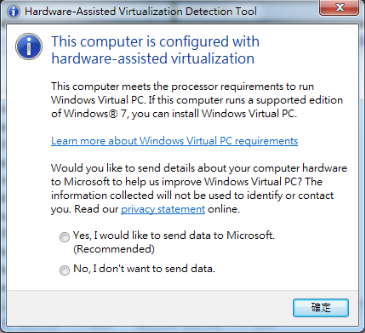
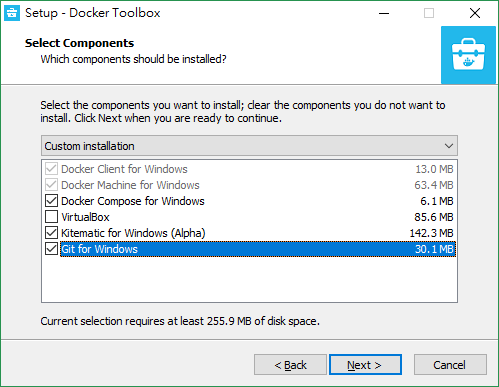

## 檢查 windows 是否有開啟虛擬化

https://www.microsoft.com/en-us/download/details.aspx?id=592

若有恭喜可以開始使用

成功畫面

若沒有參考 https://github.com/agileworks-tw/tutorial/tree/master/docker/troubleshooting/vt_x_amd_v_error

## 安裝 docker-toolbox

https://www.docker.com/products/docker-toolbox

** ※ 如果已經安裝過 virtualbox 了，請誤重新安裝，這可能會你原本的設定，而導致 virtualbox 內的虛擬機器無法啟動 **

** ※ 如果尚未安裝 Git for Windows，請勾選一起安裝 **

## 安裝 virtualbox

https://www.virtualbox.org/

## 安裝 git

https://git-scm.com/downloads

## 安裝 cmder

http://blog.miniasp.com/post/2015/09/27/Useful-tool-Cmder.aspx
